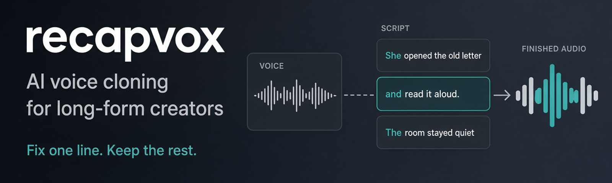

<p align="center">
  <a href="https://recapvox.com">
    
  </a>
</p>

<p align="center">
  <a href="https://recapvox.com">
    
  </a>
  <a href="https://app.recapvox.com/#/login">
    
  </a>
  <a href="https://recapvox.com/pricing">
    
  </a>
  <a href="https://recapvox.com/safety">
    
  </a>
</p>

<p align="center">
  <a href="https://recapvox.com/#demos">Hear it</a>
  ·
  <a href="#why-recapvox">Why RecapVox</a>
  ·
  <a href="#how-it-works">How it works</a>
  ·
  <a href="#built-for-long-form">Features</a>
  ·
  <a href="https://recapvox.com/pricing">Pricing</a>
  ·
  <a href="https://recapvox.com/faq">FAQ</a>
</p>

---

**Clone your voice once. Narrate every script. Fix one line without redoing the whole take.**

RecapVox is an AI voice cloning studio built for long-form creators. Paste a script, generate narration in your own voice, regenerate individual lines, and export finished audio for your editor.

Built for YouTube recaps, anime and lore channels, movie explainers, video essays, courses, tutorials, and other narration-heavy content.

<p align="center">
  <a href="https://app.recapvox.com/#/login"><strong>Start Free →</strong></a>
  &nbsp;&nbsp;·&nbsp;&nbsp;
  <a href="https://recapvox.com/#demos">Hear the demos</a>
</p>

---

## Why RecapVox

A 40-minute voiceover shouldn't take four hours.

Recording yourself means mic setup, retakes, cleanup, and going back to the microphone every time a script changes.

Generic TTS removes the microphone, but it also removes the voice your audience recognizes.

**RecapVox gives you your voice with a workflow built for long-form narration.**

| Recording yourself | Generic TTS | **RecapVox** |
| :--- | :--- | :--- |
| Mic setup | Generic voice | **Your own voice** |
| Manual retakes | Robotic delivery | **Consistent narration** |
| Re-record changed lines | Mispronounced names | **Saved pronunciations** |
| Hours behind the mic | Regenerate large takes | **Regenerate one line** |
| Manual audio workflow | Limited control | **Built for long scripts** |

---

## Change one line. Not forty minutes.

RecapVox splits long scripts into manageable segments.

If a sentence sounds wrong, a name needs fixing, or your script changes five minutes before upload, regenerate **only that segment**.

The rest of your narration stays untouched.

```text
11  Everything looked normal — until the system message arrived.      ✓

12  The kingdom believed their greatest warrior had disappeared...    ↻ Retake

13  What they didn't know was that he had been training in silence.   ✓
```

No full re-record.  
No full regeneration.  
No rebuilding a 40-minute voice track because of one sentence.

---

## Built for long-form

### Clone your voice

Upload or record a clean 3–15 second sample and create a reusable voice for narration.

### Paste long scripts

Drop in a full script and RecapVox automatically breaks it into manageable sections.

### Regenerate individual segments

Edit one section and generate a new take without touching everything around it.

### Save pronunciations

Teach RecapVox recurring names and terminology once.

```text
Sung Jin-Woo  →  sung jeen-woo
Cha Hae-In    →  chah hay-een
Shinjuku      →  shin-joo-koo
```

Reuse them across future projects.

### Keep channels consistent

Save voices and channel profiles so recurring content keeps a consistent sound.

### Export finished narration

Review your project and export your finished narration as MP3 or WAV, depending on your plan.

---

## Hear it

The demos use the same RecapVox narration pipeline.

**Manhwa recap · Movie recap · Anime / lore**

<p align="center">
  <a href="https://recapvox.com/#demos">
    <strong>▶ Listen to RecapVox</strong>
  </a>
</p>

---

## How it works

```text
Voice Sample  →  Script  →  Generate  →  Retake a Line  →  Export
```

1. **Create your voice** — Upload or record a short, clean reference sample.
2. **Paste your script** — RecapVox automatically splits long-form scripts into manageable segments.
3. **Generate** — Create narration in your cloned voice, section by section.
4. **Review** — Listen to individual segments, edit text, and correct pronunciations.
5. **Retake what needs fixing** — Regenerate one segment without recreating the rest of the project.
6. **Export** — Download the finished narration and drop it into your editing workflow.

---

## Made for creators who publish constantly

RecapVox is especially useful for:

- Manhwa and manga recaps
- Anime lore
- Movie and TV recaps
- YouTube documentaries
- Video essays
- Storytelling channels
- Tutorials
- Online courses
- Educational content
- Multi-channel publishing

The goal is simple:

**Less time recording. More time publishing.**

---

## Pricing

Start with **20 free minutes** every month.

| Plan | Narration | Voices | Built for |
| :--- | :--- | :--- | :--- |
| **Free** | 20 min / month | 1 | Trying your own voice |
| **Creator** | 5 hrs / month | 1 | Growing creators |
| **Pro** | 20 hrs / month | 3 | Weekly publishers |
| **Studio** | 60 hrs / month | 10 | High-output and multi-channel creators |

- Creator starts at **$9.99/month**
- Pro is **$19.99/month**
- Studio is **$39.99/month**

Narration minutes reset each billing period. Regenerated segments count toward your allowance because they are new generations.

When you reach your limit, generation pauses.  
No automatic overage charges.

<p align="center">
  <a href="https://recapvox.com/pricing">
    <strong>View full pricing →</strong>
  </a>
</p>

---

## Voice safety

RecapVox is built for creators narrating with their own voice or a voice they have permission to use.

- Only clone voices you own or are licensed to use
- Consent is recorded for voices
- Voice samples and projects are private to your account
- Voices can be deleted from the app
- Deceptive or unauthorized cloning is prohibited
- Abusive accounts can be disabled

If your voice or likeness is being used without permission, contact:  
[support@recapvox.com](mailto:support@recapvox.com)

[Read the Voice Safety policy →](https://recapvox.com/safety)

---

## FAQ

<details>
<summary><strong>How much audio do I need to clone my voice?</strong></summary>

About 3–15 seconds of clean reference audio is enough.

</details>

<details>
<summary><strong>Can I fix one line without regenerating the entire voiceover?</strong></summary>

Yes. RecapVox splits scripts into segments so you can edit or regenerate one section while keeping the rest of the project intact.

</details>

<details>
<summary><strong>Do regenerations use my monthly minutes?</strong></summary>

Yes. Every new generation uses compute, so regenerated segments count toward your narration allowance.

</details>

<details>
<summary><strong>What happens when I run out of minutes?</strong></summary>

Generation pauses and you can upgrade if you need more capacity. There is no automatic overage billing.

</details>

<details>
<summary><strong>Can RecapVox remember difficult names?</strong></summary>

Yes. Add names and pronunciation replacements to your pronunciation library and reuse them across projects.

</details>

<details>
<summary><strong>Is my voice private?</strong></summary>

Voice samples and projects live on your account. Only upload voices you own or have permission to use, and voices can be deleted from the app.

</details>

<p align="center">
  <a href="https://recapvox.com/faq">
    <strong>Read the full FAQ →</strong>
  </a>
</p>

---

## About this repository

This repository is the public product presence for RecapVox.

It contains product information, documentation, links, and public announcements.

The RecapVox application source code and production infrastructure are maintained in a private repository and are not included here.

---

## Links

| | |
| :--- | :--- |
| Website | [recapvox.com](https://recapvox.com) |
| App | [app.recapvox.com](https://app.recapvox.com) |
| Demos | [recapvox.com/#demos](https://recapvox.com/#demos) |
| Pricing | [recapvox.com/pricing](https://recapvox.com/pricing) |
| FAQ | [recapvox.com/faq](https://recapvox.com/faq) |
| Voice Safety | [recapvox.com/safety](https://recapvox.com/safety) |
| Terms | [recapvox.com/terms](https://recapvox.com/terms) |
| Privacy | [recapvox.com/privacy](https://recapvox.com/privacy) |
| Support | [support@recapvox.com](mailto:support@recapvox.com) |

---

<p align="center">
  <strong>Your next voiceover doesn't need another recording session.</strong>
</p>

<p align="center">
  <a href="https://app.recapvox.com/#/login">
    <strong>Create your voice free →</strong>
  </a>
</p>

<p align="center">
  <sub>
    RecapVox · AI voice cloning for long-form narration
  </sub>
</p>
